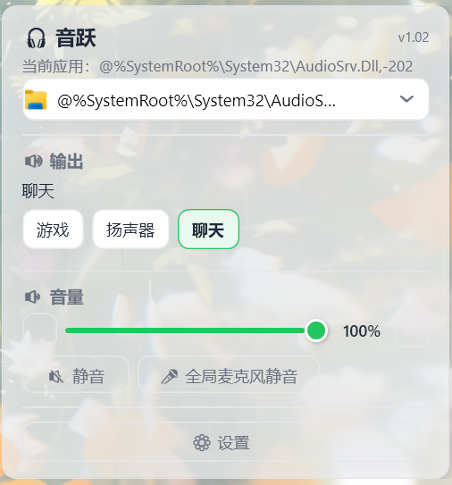
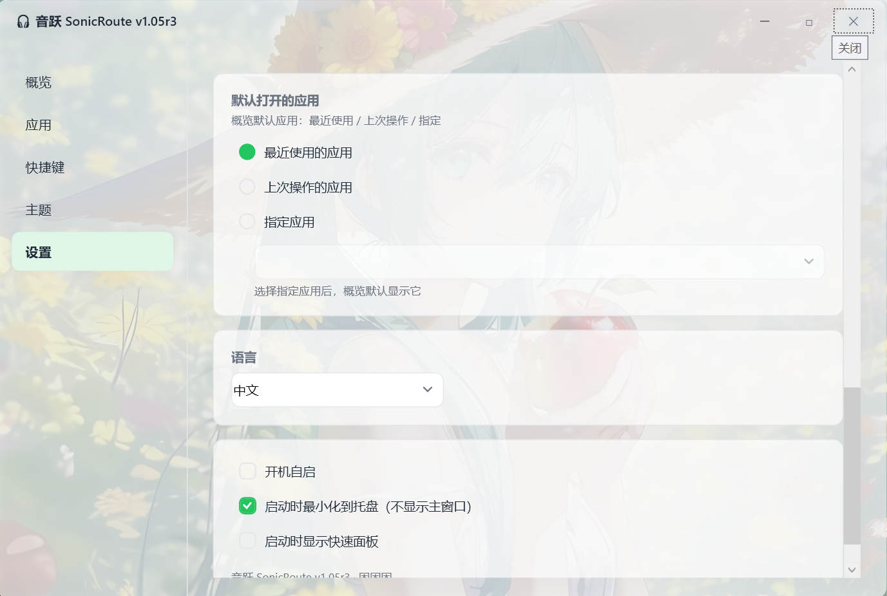
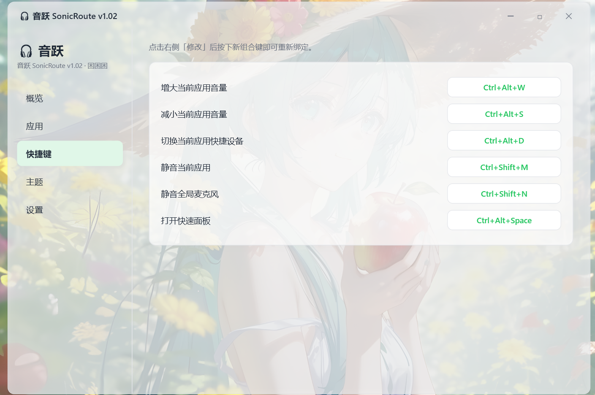

# 🎧 音跃 SonicRoute

> Windows 10/11 按应用音频快速切换工具 —— 一键把单个应用的输出设备切到耳机、音箱、显示器或虚拟设备，改完立即生效。

作者：[困困困](https://github.com/kunkunkunQoQ) ｜ 版本 **v1.0.5r4** ｜ 平台 **Windows 10 / 11 (x64)** ｜ 语言 **C# / .NET 8 / WPF**

底层完全基于 **EarTrumpet 已验证的 Per-App Audio Routing 机制** 实现（`IAudioPolicyConfigFactory` / `SetPersistedDefaultAudioEndpoint`），实测通过。

---

## ✨ 功能特性

| 特性 | 说明 |
|---|---|
| 🎯 **按应用切换输出设备** | 为单个应用设置输出设备（耳机/音箱/显示器/虚拟设备），选择即生效，Windows 音量合成器同步更新 |
| 🎤 **全局麦克风静音** | 一键静音/取消静音系统所有录音设备（设备级），任何应用的录音都生效 |
| 🧩 **托盘快捷面板** | 单击托盘图标弹出，当前应用秒切设备、调音量、静音，适合游戏时快速操作 |
| 🖥 **完整管理界面** | 双击托盘图标打开，管理应用、设备、快捷键、主题、配置 |
| 🔊 **单独应用音量** | 滑块实时调节当前应用自己的 Session 音量，不影响系统主音量和其他应用，支持静音 |
| 📋 **设备筛选 + 改名** | 设置里勾选"保留的设备"，快捷面板只显示常用设备；可为设备自定义显示名称 |
| 🕵️ **自动当前应用检测** | 自动跟随最近使用/正在使用的应用，无需手动选择；支持"最近使用 / 上次操作 / 指定应用"三种模式，前台切换实时跟随 |
| ⌨️ **全局快捷键** | 切设备、调音量、静音、全局麦克风静音、打开面板，全部可自定义 |
| 🖱 **托盘滚轮调音量** | 鼠标放在托盘右侧的任务栏区域上滚动滚轮即可调节当前应用音量（无需对准图标），OSD 实时提示 |
| 🔔 **OSD 通知** | 托盘滚轮、全局快捷键、切换设备时屏幕右上角弹出实时提示（应用名 + 音量/设备/状态），自动淡出，跟随主题/强调色/透明度 |
| 🌐 **多语言 8 种** | 中文 / English / 日本語 / 한국어 / Français / Deutsch / Español / Русский，首次启动跟随系统 |
| 🎨 **主题系统** | 深色/浅色跟随系统，多种强调色（含 RGB 自定义）、背景透明度可调 |
| 🚀 **开机自启 / 解压即用** | 内置 .NET 运行时，无需安装任何环境 |

## 🚀 快速开始

1. 前往 [Releases](https://github.com/kunkunkunQoQ/SonicRoute/releases) 选择版本下载：
   - **绿色免安装版**（`SonicRoute-v1.0.5r4.exe` / `SonicRoute-v1.0.5r4.zip`）：无需任何环境，下载即用
   - **轻量版**（`SonicRoute-v1.0.5r4-Lite.exe` / `SonicRoute-v1.0.5r4-Lite.zip`）：体积极小，需已装 .NET 8 Desktop Runtime
2. 双击运行（绿色免安装版已内置运行时）
3. 程序驻留系统托盘：
   - **单击**托盘图标 → 快捷面板（当前应用切设备 / 调音量 / 静音 / 全局麦克风静音）
   - **双击**托盘图标 → 完整管理界面
   - **右键**托盘图标 → 打开完整界面 / 快速面板 / 退出
   - **滚轮**放在托盘右侧的任务栏区域上 → 调节当前应用音量

> 也可运行 `SonicRoute.exe --main` 直接打开完整界面。

## 🖼 界面一览

### 📌 快捷面板（单击托盘图标）



单击托盘图标弹出小巧面板：顶部自动显示**当前应用**，下方「输出」一键切换常用设备、「音量」滑块实时调节，静音 / 全局麦克风静音随手可点，点击空白自动关闭，游戏时也能秒操作。

### 🖥 完整管理界面（双击托盘图标）



双击托盘图标打开完整界面，左侧导航（概览 / 应用 / 快捷键 / 主题 / 设置）：

- **概览**：与快捷面板功能一致——当前应用、输出设备快捷切换、应用音量滑块、静音 / 全局麦克风静音，一键直达
- **应用**：列出所有有音频会话的应用（正在播放的应用自动置顶），可单独操作输出设备与音量
- **快捷键**：查看与重设全部全局快捷键（内联录音，按下即生效）
- **主题**：深/浅色模式、强调色（预设 + RGB 自定义）、背景透明度
- **设置**：保留设备、设备改名、默认应用模式、语言、开机自启、启动行为

上图为「设置 → 默认打开的应用」：让概览默认跟随**最近使用的应用 / 上次操作的应用 / 指定应用**，并支持语言、开机自启等配置。

### 🔔 OSD 通知（屏幕右上角）


托盘滚轮调音量、全局快捷键、切换设备时，屏幕右上角会弹出轻量 **OSD 通知**——显示**应用名 + 音量百分比 / 设备名 / 状态**，约 1 秒后自动淡出。外观完全跟随主题（深/浅色、强调色、透明度），通知里的应用/设备名使用你自定义的名称。

### ⌨️ 多种快捷键



在「快捷键」页点击「修改」按下新组合键即可重新绑定，支持：增大/减小当前应用音量、切换当前应用快捷设备、静音当前应用、静音全局麦克风、打开快速面板。

> 💡 上图为**作者的个人快捷键设置**，并非默认快捷键；默认值见下方「全局快捷键」表格，均可自定义。

## ⌨️ 全局快捷键

| 功能 | 默认快捷键 |
|---|---|
| 增大当前应用音量 | `Ctrl + Alt + ↑` |
| 减小当前应用音量 | `Ctrl + Alt + ↓` |
| 静音当前应用 | `Ctrl + Shift + M` |
| 全局麦克风静音 | `Ctrl + Shift + N` |
| 切换当前应用快捷设备 | `Ctrl + Alt + D` |
| 打开快速面板 | `Ctrl + Alt + Space` |

> 在「设置 → 快捷键」中可点击「修改」重新绑定（免弹窗内联录音，`Esc` 取消）。若组合被其他程序占用会自动回退默认并标注 ⚠。

## 🌐 多语言支持

| 语言 | 代码 |
|---|---|
| 中文 | `zh-CN` |
| English | `en-US` |
| 日本語 | `ja-JP` |
| 한국어 | `ko-KR` |
| Français | `fr-FR` |
| Deutsch | `de-DE` |
| Español | `es-ES` |
| Русский | `ru-RU` |

- **首次启动**自动跟随 Windows 系统语言（未匹配时默认英文）
- **切换方式**：「设置 → 语言」下拉选择，重启后生效

## 🎨 主题与自定义

- **主题模式**：跟随系统 / 浅色 / 深色
- **强调色**：蓝色 / 绿色 / 粉色预设，或通过 **RGB 滑块自定义**任意颜色
- **背景透明度**：60%–100% 可调，快捷面板与完整界面统一生效（默认 85%）
- 界面为 Windows 11 风格：圆角、简洁、少量动画，深浅色统一设计语言

## 🛠 技术实现

底层完全移植并调用 **EarTrumpet 已验证的 Per-App Audio Routing** 机制：

| 组件 | 说明 |
|---|---|
| `IAudioPolicyConfigFactory` | Windows 按应用音频路由的工厂接口 |
| `SetPersistedDefaultAudioEndpoint` | 按应用**持久化**输出设备（**不改系统默认设备**） |
| `GetPersistedDefaultAudioEndpoint` | 读取应用当前持久化设备 |
| `GenerateDeviceId` / `UnpackDeviceId` | 设备 ID 完整路径编解码 |

> 音量/静音独立走 **Audio Session API**（`ISimpleAudioVolume`），按 PID 聚合全部输出会话，绝不触碰系统主音量。

- **语言/框架**：C# · .NET 8 · WPF · Windows 10/11 · x64
- **项目结构**：`SonicRoute`（WPF 主程序）/ `SonicRoute.Core`（核心库）/ `SonicRoute.Selftest`（回归自检）/ `Probe`（调试工具）

## ⚙️ 配置文件

- **位置**：`%LocalAppData%\SonicRoute\config.json`
- **格式**：JSON 纯文本（UTF-8），改动即时保存
- **内容**：保留的设备、设备自定义名称、快捷键、界面语言、主题/强调色/透明度、默认应用模式、开机自启等
- **重置**：删除该文件即可恢复全部默认设置

## 🔨 本地构建

```bash
# Debug
dotnet build SonicRoute.sln -c Debug

# 发布版（自包含单文件）
dotnet publish SonicRoute\SonicRoute.csproj -c Release -r win-x64 --self-contained true \
  -p:PublishSingleFile=true -p:IncludeNativeLibrariesForSelfExtract=true \
  -o dist\SonicRoute
```

## 📦 发布产物

每次 Release 提供 **绿色免安装版（自包含）** 与 **轻量版（框架依赖）** 两种，均含 exe 与 zip：

| 版本 | 文件 | 体积 | 安装需求 | 优点 | 缺点 |
|---|---|---|---|---|---|
| 🟢 绿色免安装版（自包含） | `SonicRoute-v1.0.5r4.exe` / `SonicRoute-v1.0.5r4.zip` | ~156MB / ~67MB | **无**（内置 .NET 运行时） | 免安装免环境，下载即用；适合普通用户、装机环境不干净的用户 | 体积大，下载慢 |
| ⚡ 轻量版（框架依赖） | `SonicRoute-v1.0.5r4-Lite.exe` / `SonicRoute-v1.0.5r4-Lite.zip` | ~1.6MB | **需已装 .NET 8 Desktop Runtime (x64)**（未装会弹官方下载引导） | 体积极小，秒下秒开；适合已装运行时/开发者的用户 | 需先装 .NET 8 运行时，否则无法运行 |

**轻量版运行时安装**：前往 https://dotnet.microsoft.com/zh-cn/download/dotnet/8.0 选择 "Windows x64 → .NET Desktop Runtime 8.0.x" 安装。

## 📋 更新日志

> 本页只展示**最新版本**的改动。

**v1.0.5r4**（修复版）
- **修复快捷键有时识别错误应用**：快捷键在共享"当前应用"为空（未打开面板 / last、fixed 模式下）时，改用**最近有音频的前台应用**而非快捷键按下瞬间的前台进程，避免前台抖动或被无关的有音频应用占用导致操作错对象；现在快捷键与快捷面板/概览识别的当前应用完全一致（静音 / 切设备 / 音量增减全部受益）
- 版本号统一为 **v1.0.5r4**

## ❓ 常见问题

**Q：为什么我改了某个应用的输出设备，系统默认设备没变？**
A：这是设计如此——SonicRoute 使用 Per-App Audio Routing 只改变**单个应用**的输出，完全不动 Windows 系统默认设备。

**Q：快捷面板里没看到我想用的设备？**
A：到「设置 → 保留的设备」勾选要显示的设备，快捷面板和概览只显示勾选的设备。

**Q：语言切换后界面没变？**
A：语言更改在**下次启动**时生效（首次启动自动跟随系统语言）。

**Q：软件是否需要安装？**
A：不需要。单文件 exe 或 zip 解压即可运行，已内置 .NET 运行时。

**Q：如果我把软件删了，怎么改回应用的播放设备？**
A：无需本软件也能改——在 Windows 任务栏右下角声音图标上**右键 → 打开"音量合成器"**，选择对应应用，在下方输出设备下拉框里改回即可（SonicRoute 改的本身就是系统音量合成器里应用的那项，卸载后依然保留）。

## 📌 版本规范

本项目发布版本号采用 **主版本.次版本.修订 + 后缀** 命名：

| 后缀 | 含义 | 是否更新 GitHub |
|---|---|---|
| `a` | **测试版**（内部验证，可能有 bug，仅供自测） | ❌ **不上传 GitHub** |
| `r` | **修复版**（修复 bug 后的正式版本） | ✅ 上传 GitHub |

- 例：`v1.0.5a` = 内部测试版；`v1.0.5r` = 修复 bug 后的正式发布版（再次修复递增 `r2`、`r3`…）
- 无后缀版本等同正式发布版（与 `r` 一致）
- 程序集内部版本号保持纯数字（如 `1.0.5`），对外发布/界面显示使用带后缀版本号
- **GitHub Release 与仓库 README 的更新日志只展示最新版本**的更新内容（含 `r` 修复版）；完整历史更新日志统一记录在 `SonicRoute源码\README.md` 中
- 本文档（README）即**版本规范 + 最新版更新日志**的记录处；历史日志见 `SonicRoute源码\README.md`；`SonicRoute源码\README.md` 同步记录归档信息

## 📄 许可证

本项目仅供学习交流使用。参考实现：[EarTrumpet](https://github.com/File-New-Project/EarTrumpet)（MIT License）。

---

**作者主页 ‖ [哔哩哔哩](https://b23.tv/TDqSAKM) ‖ [爱发电](https://www.ifdian.net/a/koukou021) ‖ [GitHub](https://github.com/kunkunkunQoQ/SonicRoute)**
