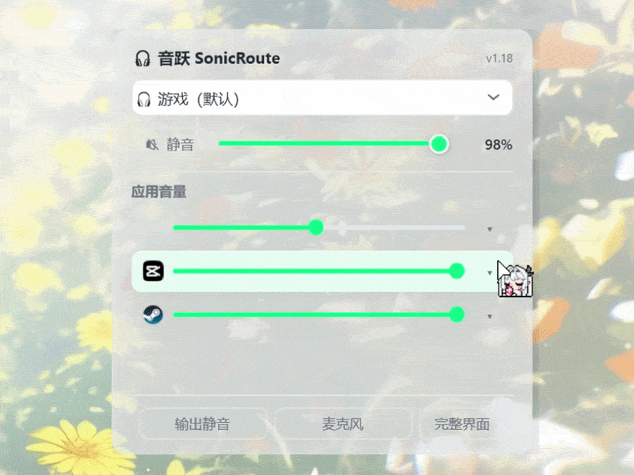

# 🎧 音跃 SonicRoute · Windows 音频枢纽

> Windows 10/11 **音频控制中心**：**当前应用 / 全局应用 / 系统默认**三档音频路由、按应用音量与静音、设备管理，一个托盘入口全盘掌控。

**v1.19** ｜ Win10/11 x64（ARM64 实验） ｜ C# / .NET 8 / WPF

---

## 🚀 快速开始

🛍 **推荐**：从 [微软商店](https://apps.microsoft.com/detail/9NQZGRTPM1NT) 安装（自动更新）；或 [Releases](https://github.com/kunkunkunQoQ/SonicRoute/releases) 下载**轻量版**（需 .NET 8 Desktop Runtime）/ **兼容版**（需 .NET Framework 4.8，体积仅 0.8MB）→ 驻留托盘：**单击**快捷面板、**双击**完整界面、**任务栏滚轮**调当前应用音量。

## ✨ 核心功能

- 🎯 **三档音频路由**：当前应用 / 全局应用 / 系统默认，互不影响可组合；一键还原全部应用（含已退出）
- 🧩 **托盘快捷面板**：简洁（Win11 音量飞出式，全部应用逐行音量）/ 经典双面板，单击秒切
- 🖥 **完整管理界面**：概览 / 应用 / 设备 / 快捷键 / 主题 / 设置一站式管理
- ⌨️ **快捷键中枢**：12 项动作全可自定义（F区 / 单键 / 鼠标键 / 滚轮 / Esc 清除）
- 🎤 **麦克风枢纽**：按应用切输入 + 全局麦克风静音 + 麦克风静音 OSD 常驻
- 🤖 **极简自动化**：快捷键 / 打开应用 / 退出应用 / 定时触发，自动切设备、调音量、静音、启动程序（多操作顺序执行 + 多路径拖拽 + 规则启停）
- 📋 **设备管理**：保留设备勾选 / 自定义名称 / 系统默认也可配置，快捷键只在保留设备间循环
- 🔇 **应用音量 + OSD**：按 Session 独立调音量，不动系统主音量；任务栏滚轮即调；OSD 不闪不跳、可拖拽定位 / 调大小
- 🧹 **内存优化 + 多语言主题**：后台内存占用 0.4~27MB 自动回收；9 语言（可编辑/导入自定义翻译）、RGB 强调色、透明度

## 🌐 多语言与翻译

内置 9 种语言，应用内可**导出 / 编辑 / 导入**（设置 → 语言 → 语言文件，支持自定义语言），**切换 / 导入即时生效**。想**提交翻译**？→ [提交建议](https://github.com/kunkunkunQoQ/SonicRoute/issues/new/choose)

## 📦 下载

| 版本 | 文件 | 体积 | 需求 |
|---|---|---|---|
| 🛍 微软商店（推荐） | [Store 搜索 SonicRoute](https://apps.microsoft.com/detail/9NQZGRTPM1NT) | — | 自动更新 |
| ⚡ 轻量版 | `SonicRoute-v1.19-Lite-x64.exe` / `.zip`；ARM64：`SonicRoute-v1.19-Lite-arm64.exe` / `.zip`（🧪 实验） | ~27MB / ~6.8MB | 需 .NET 8 Desktop Runtime |
| 🪟 兼容版（.NET Framework 4.8） | `SonicRoute-v1.19-Legacy-x64.zip` | ~0.8MB | 需 .NET Framework 4.8（Win10 1903+ / Win11 默认自带） |

## 📚 完整文档 → [Wiki](https://github.com/kunkunkunQoQ/SonicRoute/wiki)

[📖 使用指南](https://github.com/kunkunkunQoQ/SonicRoute/wiki/01-%E4%BD%BF%E7%94%A8%E6%8C%87%E5%8D%97)（安装 / 面板 / 完整界面 / 场景教程）｜ [✨ 功能特性](https://github.com/kunkunkunQoQ/SonicRoute/wiki/02-%E5%8A%9F%E8%83%BD%E7%89%B9%E6%80%A7) ｜ [⌨️ 快捷键](https://github.com/kunkunkunQoQ/SonicRoute/wiki/03-%E5%BF%AB%E6%8D%B7%E9%94%AE)（完整默认键表 + 绑定规则）｜ [❓ 常见问题](https://github.com/kunkunkunQoQ/SonicRoute/wiki/04-%E5%B8%B8%E8%A7%81%E9%97%AE%E9%A2%98) ｜ [🛠 技术实现](https://github.com/kunkunkunQoQ/SonicRoute/wiki/05-%E6%8A%80%E6%9C%AF%E5%AE%9E%E7%8E%B0) ｜ [📌 版本相关](https://github.com/kunkunkunQoQ/SonicRoute/wiki/06-%E7%89%88%E6%9C%AC%E7%9B%B8%E5%85%B3)（版本规则 + 更新日志）

## 📌 版本相关

完整版本历史（版本规则 + 更新日志）见 [Wiki 版本相关](https://github.com/kunkunkunQoQ/SonicRoute/wiki/06-%E7%89%88%E6%9C%AC%E7%9B%B8%E5%85%B3)。

> 📌 **下一版本预告**：持续优化使用体验与维护项目 bug ｜ 大版本更新暂缓，时间未定，但一定不会缺席

💡 有建议或反馈？→ [提交建议](https://github.com/kunkunkunQoQ/SonicRoute/issues/new/choose)

---

## 🧩 其他作品

- 🎧 **[SilentPlayer](https://github.com/kunkunkunQoQ/SilentPlayer)** — 极简、静默、低资源占用的 Windows 音频播放器｜[与音跃配合使用](https://github.com/kunkunkunQoQ/SonicRoute/wiki/01-%E4%BD%BF%E7%94%A8%E6%8C%87%E5%8D%97#52-%E7%BB%84%E5%90%88%E5%9C%BA%E6%99%AFsilentplayer-%E9%9F%B3%E6%95%88%E6%9D%BF%E7%B1%BB%E4%BC%BC-soundpad)（拼出按键音效板，类似 Soundpad）

---

**作者主页 ‖ [哔哩哔哩](https://b23.tv/TDqSAKM) ‖ [爱发电](https://www.ifdian.net/a/koukou021) ‖ [GitHub](https://github.com/kunkunkunQoQ/SonicRoute)**
