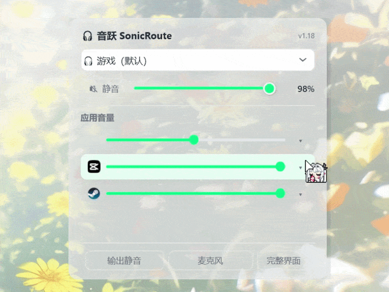

# 🎧 音跃 SonicRoute

**简体中文** | [English](README.en.md)

更快捷地控制 Windows 每个应用的声音。

SonicRoute 是一个常驻托盘的 Windows 音频控制工具，可以快速控制当前应用的输出 / 输入设备、音量和静音，并通过快捷键、任务栏滚轮、OSD 和自动化减少反复进入系统设置的操作。

按应用音频路由 · 任务栏滚轮 · 全局快捷键 · 托盘面板 · OSD · 自动化

**v1.20 正式版已发布** ｜ Windows 10 2004+ / Windows 11 · x64 · ARM64 实验 · C# / WPF

📥 [Microsoft Store](https://apps.microsoft.com/detail/9NQZGRTPM1NT) ｜ [GitHub Releases](https://github.com/kunkunkunQoQ/SonicRoute/releases) ｜ [Wiki](https://github.com/kunkunkunQoQ/SonicRoute/wiki)

> 🎉 **[v1.20 正式版](https://github.com/kunkunkunQoQ/SonicRoute/releases/tag/v1.20)** 已发布：每应用实时声音活动、更灵活的自动化与命令行调用，以及快速面板、OSD 和后台处理改进。

---

## 为什么做 SonicRoute？

玩游戏、看视频或同时使用多个音频应用时，经常需要切换耳机 / 音箱、调整某个应用的音量、切换输入设备。Windows 本身具备这些能力，但这些操作通常需要进入系统音频界面才能完成。

SonicRoute 的出发点是把这些高频操作从系统设置里解放出来——让控制声音像按快捷键一样快，而不是打开一层层菜单。

## 和 Windows 音量合成器有什么不同？

Windows 本身已经可以调整每个应用的音量和输出设备，SonicRoute 提供的是更快捷的交互方式：

- 用快捷键直接操作当前应用，无需切出游戏或窗口
- 鼠标停在任务栏上滚轮即可调整当前应用音量
- 托盘快速面板查看和控制正在出声的应用
- 输出 / 输入设备快速切换
- OSD 即时反馈
- 自动化按条件执行操作

不需要频繁打开系统设置页面。

## ✨ 核心功能

- 🎯 **应用音频路由**：独立切换当前应用、全部运行中应用或系统默认的输出 / 输入设备
- 🖱 **快速控制**：托盘快速面板集中控制音量、静音和设备，并显示应用实时声音活动，支持简洁 / 经典布局
- ⌨️ **快捷键与任务栏滚轮**：无需切出当前窗口即可调音量、切设备、静音或控制麦克风
- 🖥 **OSD 提示**：即时显示操作结果，外观、位置、音量条和麦克风静音提示均可自定义
- 🤖 **自动化与命令行**：按应用事件、快捷键、定时或启动执行多步规则，也可用 `sr "规则名称或ID"` 直接调用
- 🎨 **外观与个性化**：深浅主题、九种语言、设备筛选与自定义名称

具体操作方式与完整设置项见 [Wiki](https://github.com/kunkunkunQoQ/SonicRoute/wiki)。

首次使用短命令需正常启动新版一次，再重新打开终端；完整用法见 [命令行调用说明](docs/automation-command-line.md)。

## 🚀 快速开始

🛍 **商店安装**：从 [Microsoft Store](https://apps.microsoft.com/detail/9NQZGRTPM1NT)（x64，自动更新）获取，版本以上架状态为准。

从 [GitHub Releases](https://github.com/kunkunkunQoQ/SonicRoute/releases/tag/v1.20) 下载 **v1.20 正式版**：

| 版本 | 说明 |
|---|---|
| ⚡ Lite x64 | 主要便携版本；单 EXE，需 x64 .NET 8 Desktop Runtime |
| 🧪 Lite ARM64（实验） | 单 EXE，需 ARM64 .NET 8 Desktop Runtime；尚未完成 ARM64 真机完整验证 |
| 🪟 Legacy x64 | .NET Framework 4.8 版本；解压完整目录后运行，无需安装 .NET 8 |

> v1.19 Release Assets 中仍保留旧的自包含版本；自 v1.20 起不再提供这种发布形式。
>
> Microsoft Store 的 **v1.20 x64 Lite 包已提交审核**，商店版本以上架状态为准。

## 📚 完整文档 → [Wiki](https://github.com/kunkunkunQoQ/SonicRoute/wiki)

| 文档 | 内容 |
|---|---|
| [01 · 使用指南](https://github.com/kunkunkunQoQ/SonicRoute/wiki/01-%E4%BD%BF%E7%94%A8%E6%8C%87%E5%8D%97) | 安装、面板、完整界面与场景教程 |
| [02 · 功能特性](https://github.com/kunkunkunQoQ/SonicRoute/wiki/02-%E5%8A%9F%E8%83%BD%E7%89%B9%E6%80%A7) | 功能介绍与控制范围 |
| [03 · 快捷键](https://github.com/kunkunkunQoQ/SonicRoute/wiki/03-%E5%BF%AB%E6%8D%B7%E9%94%AE) | 默认按键、绑定和使用场景 |
| [04 · 自动化规则](https://github.com/kunkunkunQoQ/SonicRoute/wiki/04-%E8%87%AA%E5%8A%A8%E5%8C%96%E8%A7%84%E5%88%99) | 六种触发、十七种操作、复制与排序 |
| [05 · 命令行执行规则](https://github.com/kunkunkunQoQ/SonicRoute/wiki/05-%E5%91%BD%E4%BB%A4%E8%A1%8C%E6%89%A7%E8%A1%8C%E8%A7%84%E5%88%99) | sr 用法、执行结果与退出码 |
| [06 · 常见问题](https://github.com/kunkunkunQoQ/SonicRoute/wiki/06-%E5%B8%B8%E8%A7%81%E9%97%AE%E9%A2%98) | 安装、设备、音量、自动化与性能排查 |
| [07 · 技术实现](https://github.com/kunkunkunQoQ/SonicRoute/wiki/07-%E6%8A%80%E6%9C%AF%E5%AE%9E%E7%8E%B0) | 源码结构、音频接口与构建方法 |
| [08 · 版本相关](https://github.com/kunkunkunQoQ/SonicRoute/wiki/08-%E7%89%88%E6%9C%AC%E7%9B%B8%E5%85%B3) | 当前下载、1.20 更新与发布规则 |
| [09 · 版本历史](https://github.com/kunkunkunQoQ/SonicRoute/wiki/09-%E7%89%88%E6%9C%AC%E5%8E%86%E5%8F%B2) | 旧版更新日志与版本索引 |

## 📌 版本计划

- **当前稳定版：v1.20**（2026-10-02 转为正式发布）
- **年底大版本**：仍按计划保留，具体版本号与内容以后续公告为准

当前下载、1.20 更新和发布规则见 [Wiki 版本相关](https://github.com/kunkunkunQoQ/SonicRoute/wiki/08-%E7%89%88%E6%9C%AC%E7%9B%B8%E5%85%B3)，旧版日志见 [Wiki 版本历史](https://github.com/kunkunkunQoQ/SonicRoute/wiki/09-%E7%89%88%E6%9C%AC%E5%8E%86%E5%8F%B2)。

💡 有建议或反馈？→ [提交建议](https://github.com/kunkunkunQoQ/SonicRoute/issues/new/choose)

---

## 🧩 其他作品

- 🎧 **[SilentPlayer](https://github.com/kunkunkunQoQ/SilentPlayer)** — 极简、静默、低资源占用的 Windows 音频播放器
- 💡 与音跃配合可拼出按键音效板（类似 Soundpad）→ [组合场景](https://github.com/kunkunkunQoQ/SonicRoute/wiki/01-%E4%BD%BF%E7%94%A8%E6%8C%87%E5%8D%97#52-%E7%BB%84%E5%90%88%E5%9C%BA%E6%99%AFsilentplayer-%E9%9F%B3%E6%95%88%E6%9D%BF%E7%B1%BB%E4%BC%BC-soundpad)
- 📦 **[WinAudioRoute](https://github.com/kunkunkunQoQ/WinAudioRoute)** — 音跃的 Windows 音频控制库（.NET）：设备 / 会话 / 按应用路由 / 事件 / CLI

---

**作者主页 ‖ [哔哩哔哩](https://b23.tv/TDqSAKM) ‖ [爱发电](https://www.ifdian.net/a/koukou021) ‖ [GitHub](https://github.com/kunkunkunQoQ/SonicRoute)**
